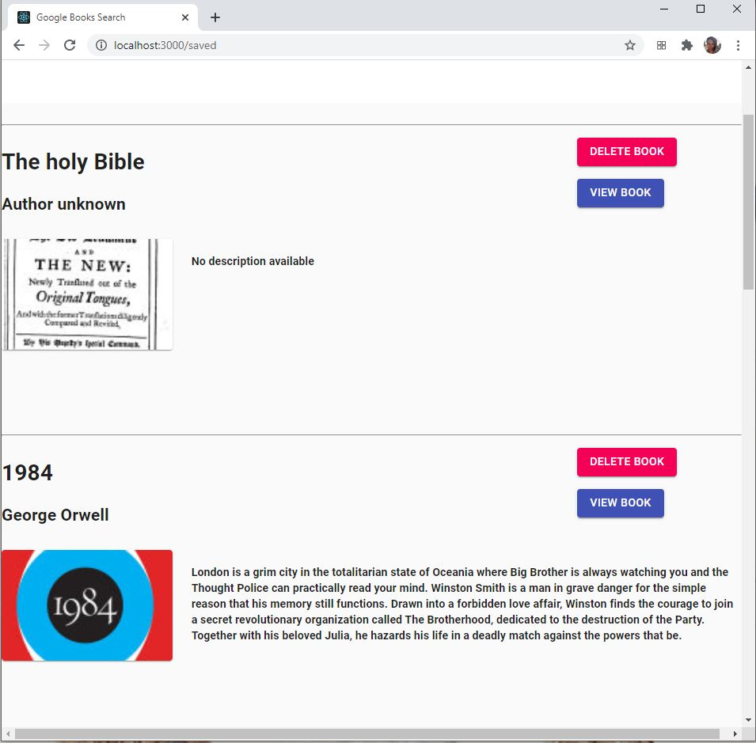

# quatrepattes 

# Table of contents
1. [Description](#Description)
2. [Installation instructions](#Installation-instructions)
3. [Usage](#usage)
4. [Contributions](#Contributions)
5. [Testing instructions](#Testing-instructions)
6. [License](#License)
7. [Questions](#Questions)

## Description: 
This is a React App that uses the Google Books API to allow users to look up books of their choosing. Users can then visit a website for more information on that book, or they can enter the book into their library. Users can also view their library. 

This application is deployed  <a href='https://skolnikskolnik.github.io/skolportfolio'>here.</a>

The user is greeted with the following screen:

They can also view their bookshelf to delete books:

## Installation instructions: 
Users should npm install before running the program.

## Usage: 
This is for a user who has a lot of books that they want to keep track of, weather in digital or real format.

## Contributions: 
This us currently a solo project of skolnikskolnik

## Testing instructions: 
Enter a book into the search term, add it to your library, view the website, then go to the Bookshelf page and view and/or delete a book.

## License:  
This project is covered under the MIT License license.

## Questions
Visit my <a href='https://www.github.com/skolnikskolnik'>github page.</a> 

Email me at jtskolnik@gmail.com with any additional questions you may have. I am always happy to talk to users of my product!
    